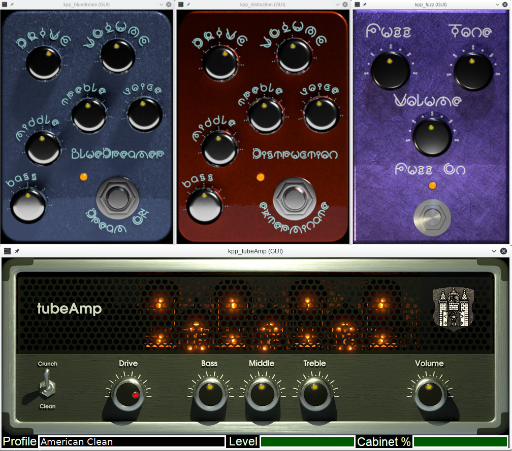

Kapitonov Plugins Pack (KPP)
============================

Latest release is 1.2.1.

THIS IS VST3 LINUX VERSIONS!
===========================
(As well as Mac and Win, experimental)

LV2 versions (for Ardour, Carla, Qtractor) [here](https://github.com/olegkapitonov/Kapitonov-Plugins-Pack)

> Set of plugins for guitar sound processing.
> VST3 versions compatible with hosts such as REAPER, Bitwig Studio, Carla.

Binary files are available for Linux 64-bit systems.
Source code can be compiled for Linux 64-bit or 32-bit.

**EXPERIMENTAL** Mac and Win64 VST3 versions now available [here](https://kpp-tubeamp.com/downloads)!



### Currently available plugins

1. tubeAmp.
   Advanced guitar tube amp emulator. Contains preamp,
   tonestack, power amp with voltage sag, cabinet emulators.
   Emulation parameters of each component are set by profile files.
2. Bluedream.
   Booster/Tube Screamer pedal with equalizer (tonestack).
   Has GUI
3. Distruction.
   Distortion pedal with equalizer (tonestack).
   Has GUI.
4. Fuzz.
   Vintage fuzz pedal.
   Has GUI.
5. Deadgate.
   Effective Noise Gate/Dead Zone effect plugin.
6. Octaver.
   Analog octaver pedal.
7. Single2Humbucker.
   Plugin for emulation humbucker pickup sound with
   single coil pickup on the guitar. Useful for playing
   heavy-metal on Stratocaster guitar with single coil pickups.

tubeAmp is the main and most complex plugin in the set.
It can be used to emulate the sound of any common models
of guitar combo amplifiers.

You can create and edit \*.tapf profiles with **tubeAmp Designer**.

### IMPORTANT!!!

The input level at the beginning of the plugins chain should be -20 dB!
You can use plugins like https://github.com/x42/meters.lv2 to measure
and adjust the signal level.


### Dependencies for using

1. VST3 compatible host on Linux operating system.
   It can be REAPER, Bitwig Studio, any other VST3 host.
2. Cairo library for GUI.
3. fftw3 library.

In Ubuntu run:

`apt install libxcb1 libxcb-util1 libxcb-icccm4 libcairo2 libxau6 libxdmcp6 libpixman-1-0 libfontconfig1 libfreetype6 libpng16-16 libxcb-shm0 libxcb-render0 libxrender1 libx11-6 libxext6 zlib1g libbsd0 libexpat1 libfftw3-3 libxcb-cursor0 libxcb-xkb1 libxkbcommon0 libxkbcommon-x11-0`

### Dependencies for building

1. g++ compiler.
2. Cairo library development files (headers, pkg-info).
3. Boost development files.
4. Faust 2.x compiler and libraries.
5. [VST3 SDK](https://www.steinberg.net/vst3sdk)
6. gtkmm-3.0
7. sqlite development files

In Ubuntu run:

`apt install libxcb1-dev libxcb-util-dev libxcb-icccm4-dev libcairo2-dev libpixman-1-dev libfontconfig1-dev libfreetype6-dev libpng-dev libxcb-shm0-dev libxcb-render0-dev libxrender-dev libx11-dev libxext-dev zlib1g-dev libbsd-dev libexpat1-dev libfftw3-dev libboost-all-dev libxcb-cursor-dev libxcb-keysyms1-dev libxcb-xkb-dev libxkbcommon-dev libxkbcommon-x11-dev libgtkmm-3.0-dev libsqlite3-dev faust`

**Attention!!!** Check version of `faust` in your distro! Ubuntu Bionic Beaver has old 0.9.x version!
In this case build latest version of `faust` from source.

### How to build and install

Build process based on VST3.8 SDK (recommended).

1. Unpack [VST3 SDK](https://www.steinberg.net/vst3sdk) into the VST_SDK directory.
2. Clone this repository to KPP-VST3 directory (git clone https://github.com/olegkapitonov/KPP-VST3).
3. cd VST_SDK/vst3sdk
4. mkdir build
5. cd build
6. VST3.8 SDK needs to be patched to support the legacy SMTG_MYPLUGINS_SRC_PATH variable. Run the following command to patch CMakeLists.txt of VST SDK:
```
cat >> "../CMakeLists.txt" <<'EOF'
# Honor legacy SMTG_MYPLUGINS_SRC_PATH for out-of-tree plugin trees
if(SMTG_MYPLUGINS_SRC_PATH)
    add_subdirectory(${SMTG_MYPLUGINS_SRC_PATH} myplugins)
endif()
EOF
```
7. cmake -DCMAKE_POLICY_VERSION_MINIMUM=3.5 -DCMAKE_BUILD_TYPE=Release -DSMTG_MYPLUGINS_SRC_PATH="../../../KPP-VST3" -DSMTG_ENABLE_VST3_PLUGIN_EXAMPLES=OFF -DSMTG_ENABLE_VST3_HOSTING_EXAMPLES=OFF -DSMTG_ENABLE_VSTGUI_SUPPORT=ON -DCMAKE_CXX_FLAGS="-include cstdint -include limits -include cstdio"  ..
8. make
9. Plugins will be created in VST_SDK/VST3_SDK/build/VST3/Release and symlinks will be created in ~/.vst3.

Build process based on VST3.6 SDK (legacy).

1. Unpack [VST3 SDK 3.6](https://github.com/steinbergmedia/vst3sdk/releases/tag/vstsdk3612_03_12_2018_build_67) into the VST_SDK directory.
2. Clone this repository to KPP-VST3 directory (git clone https://github.com/olegkapitonov/KPP-VST3).
3. cd VST_SDK/VST3_SDK
4. mkdir build
5. cd build
6. cmake -DCMAKE_POLICY_VERSION_MINIMUM=3.5 -DCMAKE_BUILD_TYPE=Release -DSMTG_MYPLUGINS_SRC_PATH="../../../KPP-VST3" -DSMTG_ADD_VST3_PLUGINS_SAMPLES=FALSE -DSMTG_ADD_VST3_HOSTING_SAMPLES=FALSE -DSMTG_ENABLE_VSTGUI_SUPPORT=ON -DCMAKE_CXX_FLAGS="-include cstdint -include limits -include cstdio -include exception" ..
7. make
8. Plugins will be created in VST_SDK/VST3_SDK/build/VST3/Release and symlinks will be created in ~/.vst3.

### How to install binary versions

1. For Debian Buster (10) download KPP-VST3-1.2.1-binary-debian10.tar.bz2.
2. For Ubuntu LTS and other distributions download KPP-VST3-1.2.1-binary-ubuntu-bionic.tar.bz2.
3. Copy *.vst3 folders to ~/.vst3
4. Launch host application (e. g. REAPER). Find desired plugin in library,
   names will have `kpp_` prefix.
5. Copy *tubeamp Profiles* directory to ~/tubeAmp Profiles or to any other place you prefer.
6. kpp_tubeamp plugin will produce no sound until *.tapf profile is loaded!

### Quick start guide

[English](https://github.com/olegkapitonov/Kapitonov-Plugins-Pack/blob/master/guide.md)

[Русский](https://github.com/olegkapitonov/Kapitonov-Plugins-Pack/blob/master/guide_ru.md)


## Development

DSP code is written in Faust language. GUI and support code is written in C and C++
with VST3 and VSTGUI4 SDK.

## License

GPLv3+.
